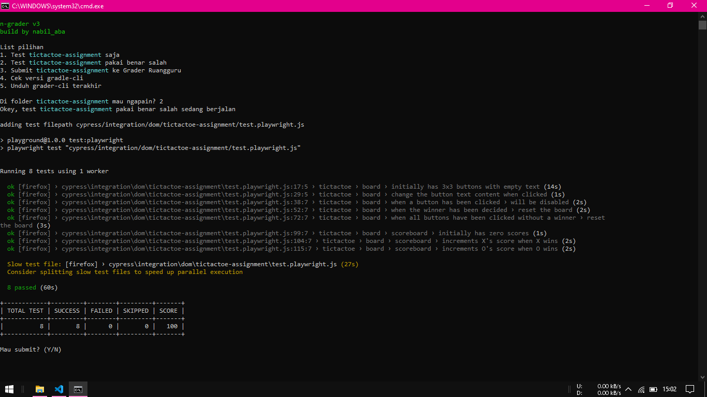
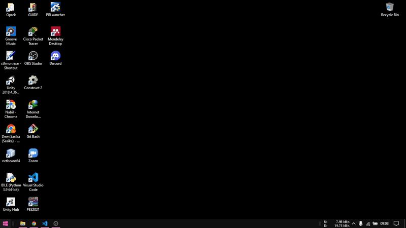
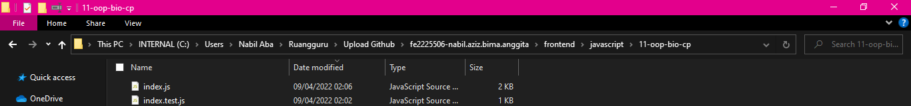
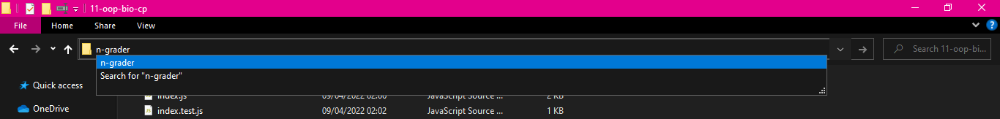
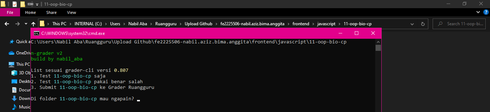

# N-Grader - Easy to use

N-Grader adalah peralatan untuk memudahkan siswa dalam melakukan test dan submit ke grader ruangguru.


## Note
```
Pastikan sudah terpasang grader-cli dari ruangguru
```

## Cara Pasang
1. Download versi terakhir dari [sini](https://github.com/nabilaba/N-Grader/releases/download/v2/N-Grader.zip)
2. Ekstrak dan pindahkan folder N-Grader di C:\Program Files\
3. Masuk ke Environment Variables
4. Tambahkan N-Grader ke PATH (C:\Program Files\N-Grader\)

5. Restart Command Prompt

## Cara Pakai
1. Masuk ke folder yang tersedia test dari ruangguru

2. Ketik n-grader di address bar file explorer

3. Pilih sesuai yang tersedia di list yang muncul


## Changelog
### Version 2
- Added support ansicon
- More control
- Update submit

### Version 1
- Initial Release

> Note: `find a bug? it's features haha.`